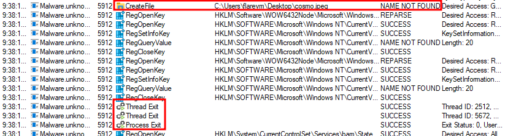

<!--
William Moody (@bmdyy)
05.03.2023
-->

# Final Assessment

**Target:** X-X.BonusBinaries\Malware.unknown.exe.malz

## Summary:

This sample exfiltrates `cosmo.jpeg` from the user's desktop via DNS requests and then exits. No files are written/modified, no commands are run, and no forms of persistence seem to be in place.

## Basic Static Analysis

- **MD5:** 812A7C7EB9D7A4332B9E166AA09284D7
- **SHA1:** EC0D565AFE635C2C7863B2A05DF8A49C58B703A3
- **SHA256:** 81A10784AE60A58A969E858C9C4A2AE0D4EBE46E9BD6776992461C062F70099D
- **Size:** ~124 KB
- Flagged by **3/69** vendors on [VirusTotal](https://www.virustotal.com/gui/file/81a10784ae60a58a969e858c9c4a2ae0d4ebe46e9bd6776992461c062f70099d)
- **32-bit** executable

```
λ floss -n 8 Malware.unknown.exe > floss.txt
```

This is very likely a **Nim** binary:

```
λ grep -i 'nim' floss.txt | head
fatal.nim
fatal.nim
parseutils.nim
strutils.nim
streams.nim
setPositionImpl
getPositionImpl
oserr.nim
<SNIP>
```

File path `Desktop\cosmo.jpeg` is hardcoded into the binary:

```
λ grep -i \\ floss.txt
@Desktop\cosmo.jpeg
```

Some DLL files appear as strings in the binary:

```
λ grep -i '\.dll' floss.txt               
@Can't load inet_ntop proc from Ws2_32.dll
@Ws2_32.dll                               
@Ws2_32.dll                               
@Bcrypt.dll                               
@Bcrypt.dll                               
KERNEL32.dll                              
msvcrt.dll                                
USER32.dll                                
```

What looks like three obfuscated domains:

```
λ grep -i 'l.o.c.a.l' floss.txt
@hwtwtwpw:w/w/whwewyw.wywowuwuwpw.wlwowcwawlw
@axuxtxhx.xnxsx.xlxoxcxaxlx
@.BcBoBsBmBoBsBfBuBrBbBoBoBtBsBeBmBpBoBrBiBuBmB.BlBoBcBaBlB
```

The three strings turn into:
- `http://hey.youup.local`
- `auth.ns.local`
- `.cosmosfurootsemporium.local`

## Basic Dynamic Analysis

When run, the sample looks up `hey.youup.local`:


If no response is received for `hey.youup.local`, the program quits:


If `hey.youup.local` is up, the program continues running and repeatedly sends GET requests to `http://hey.youup.local`:


This continue until `hey.youup.local` "goes down", at which point there is a DNS lookup request to `auth.ns.local` and then DNS exfiltration begins using `.cosmosfurootsemporium.local`:


**Note:** To recreate:
1. Modify FlareVM's hosts file to point `hey.youup.local` to localhost
2. Run inetsim on REMnux
3. Start a Python http.server on FlareVM to receive the first HTTP request and then close it to initiate DNS exfiltration

It appears that the DNS requests are exfiltrating `Desktop\cosmo.jpeg`:


Once it finishes exfiltrating `Desktop\cosmo.jpeg`, the sample exits:


If `Desktop\cosmo.jpeg` does not exist, the sample exits:



## Advanced Static Analysis

The program appears to be obfuscated, making use of a very large number of functions making it very hard and tiring to trace:


Since we already know what this binary does, I won't bother getting into advanced dynamic analysis, especially given the obfuscation in place.

## YARA Rule

The following YARA rule may be used to detect the sample on a computer:

```yara
rule DNS_Exfil_Cosmo_JPEG {
    
    meta: 
        last_updated = "2023-03-05"
        author = "William Moody"
        description = "Detects (X-X.BonusBinaries) Malware.unknown.exe"

    strings:
		$cosmoPath = "Desktop\\cosmo.jpeg" ascii
		$nim = "nim"
		$PE_magic_byte = "MZ"
		$d1 = "hwtwtwpw:w/w/whwewyw.wywowuwuwpw.wlwowcwawlw" ascii
		$d2 = "axuxtxhx.xnxsx.xlxoxcxaxlx" ascii
		$d3 = ".BcBoBsBmBoBsBfBuBrBbBoBoBtBsBeBmBpBoBrBiBuBmB.BlBoBcBaBlB" ascii

    condition:
        ($PE_magic_byte and $nim)
		and $cosmoPath
		and ($d1 and $d2 and $d3)
}
```

Example output:

```
λ yara64 rule.yara -r C:\ -w -p 32
DNS_Exfil_Cosmo_JPEG C:\\Users\flarevm\Desktop\Malware.unknown.exe
```